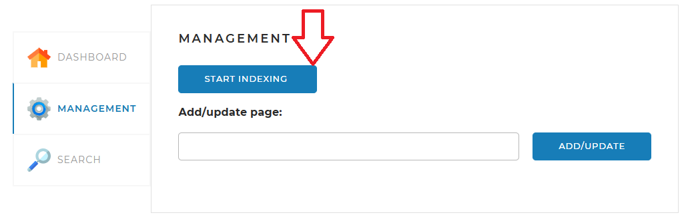
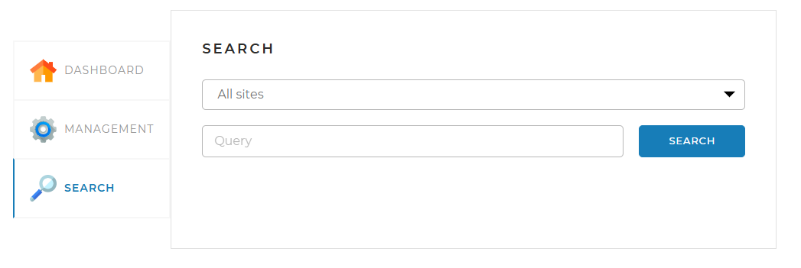

## Поисковый движок - SearchableSearchBot

Пред Вами поисковый движок который представляет собой Spring-приложение, 
работающее с локально установленной базой данных MySQL, 
имеющее простой веб-интерфейс и API, через который им можно управлять и получать результаты поисковой выдачи по запросу. 

**Принципы работы поискового движка**

1. Поисковый движок самостоятельно обходит все страницы заданных сайтов и индексирует их таким образом, 
что потом может находить наиболее релевантные страницы по любому поисковому запросу.
2. Пользователь присылает запрос через API движка. Запрос — это набор слов, по которым нужно найти страницы сайта.
3. Запрос трансформируется в список слов, переведённых в базовую форму.
4. В индексе ищутся страницы, на которых встречаются все эти слова.
5. Результаты поиска ранжируются, сортируются и отдаются пользователю.

**В данном проекте используются следующие технологии:**
1. Maven - для управления зависимостями и сборкой проекта.
2. Jsoup - для парсинга HTML-страниц.
3. Spring Thymeleaf - для создания веб-приложения с использованием шаблонов.
4. Spring Web - для создания REST-сервисов и управления данными. 
5. Spring Data Jpa - для работы с базой данных.
6. Lucene.morphology - для лемматизации слов.
7. Lombok - для упрощения кода и уменьшения количества boilerplate-кода.

**Для проверки работы приложения использовались:**
1. MySQL - для хранения данных.
2. Postman - для тестирования API.
3. VisualVM - для отслеживания работы приложения.

**Инструкция по запуску проекта:**
1. Заполнить файл с конфигурации - application.yaml в соотвествии с Вашими настройками для корректного подключения к БД
(username, password и далее по необходимости).
2. Выбрать сайты/сайт для парсинга и скорретировать данный список в конфигурационном файле.
3. Запустить приложение.
4. Открыть веб-интерфейс приложения по адресу http://localhost:8080/ и во вкладке "MANAGEMENT" запустить обход страниц 
(займет время, в зависимости от количества сайтов и количества страниц на них) выбранных сайтов нажатием кнопки "START INDEXING".
   
5. При необходимости заново проиндексировать страницу добавленного сайта необходимо в поле "Add/update page" добавть страницу и нажать кнопку "ADD\UPDATE".
6. Для осуществления поиска совпадений на страницах сайтов или на выбранном сайте по ключевому слову/словам необходимо перейти во вкладку "SEARCH",
ввести в поле "Query" ключевое слово/слова и нажать кнопку "SEARCH".
   